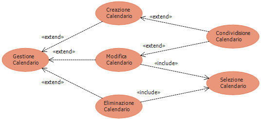

Descrizione dei casi d'uso
===

Titolo | Creazione Calendario
--- | ---
**Descrizione** | Creazione di un nuovo calendario di eventi, inizialmente vuoto
**Relazioni** | 
**Attori** | Utente
**Precondizioni** | Nessuna
**Postcondizioni** | <ul><li>Il sistema contiene un nuovo calendario</li></ul>
**Scenario principale** | <ol><li>L'utente inserisce il nome del calendario e può inserire uno o più amici con cui condividere il calendario</li><li>L'utente chiede di salvare il calendario</li><li>Il sistema crea il nuovo calendario</li></ol>
**Scenari alternativi** | <ol start="1"><li>Se il nome del calendario inserito dall'utente identifica già un altro calendario pre-esistente<ol type="i"><li>Il sistema impedisce all'utente di creare il calendario (passo 2 dello scenario principale)</li></ol></li></ol>
**Requisiti non funzionali** | Nessuno
**Punti aperti** | Nessuno
