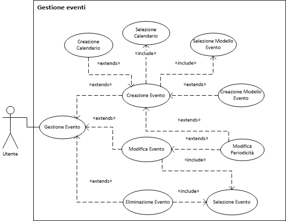

Descrizione dei casi d'uso
===

Titolo | Creazione evento
--- | ---
**Descrizione** | Aggiunta di un nuovo evento ad un calendario esistente
**Relazioni** | 
**Attori** | Utente
**Precondizioni** | Nessuna
**Postcondizioni** | <ul><li>Un nuovo evento è stato inserito nel calendario</li></ul>
**Scenario principale** | <ol><li>L'utente seleziona il calendario (CU *Selezione calendario*)</li><li>L'utente inserisce un nome *(default: vuoto, valori ammessi: stringa non vuota)*</li><li>L'utente inserisce una data *(default: data odierna/ora corrente)*</li><li>L'utente inserisce una durata *(default: 60 minuti, valori ammessi: > 0)*</li><li>L'utente può inserire un luogo *(default: vuoto)*</li><li>L'utente può inserire una descrizione *(default: vuoto)*</li><li>L'utente può modificare la periodicità (*default: Mai*, CU *Modifica periodicità*)</li><li>L'utente può selezionare un modello</li><ol type=a><li>L'utente completa i campi aggiuntivi del modello</li></ol><li>L'utente chiede di salvare l'evento</li><li>Il sistema salva il nuovo evento</ol>
**Scenari alternativi** | <ol start=1><li>Il sistema non contiene calendari o l'utente sceglie di creare un nuovo calendario<ol type=a><li>L'utente crea un nuovo calendario (CU *Creazione calendario*)</li><li>*Si ritorna al passo 1* dello scenario principale</li></ol></li></ol><ol start=8><li>Il sistema non contiene modelli o l'utente sceglie di creare un nuovo modello<ol type=a><li>L'utente crea un nuovo modello (CU *Creazione modello*)</li><li>*Si ritorna al passo 8a* dello scenario principale</li></ol></li></ol>
**Requisiti non funzionali** | Nessuno
**Punti aperti** | Nessuno
**Note** | I passi 1-8 posso essere eseguiti in qualsiasi ordine
