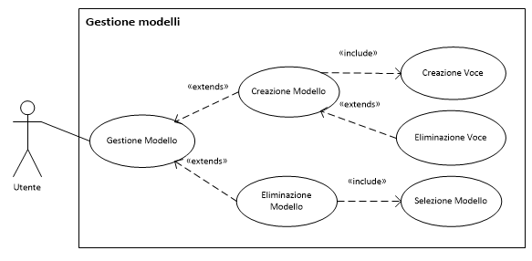

Descrizione dei casi d'uso
===

Titolo | Creazione modello evento
--- | ---
**Descrizione** | Creazione di un nuovo modello di evento
**Relazioni** | 
**Attori** | Utente
**Precondizioni** | Nessuna
**Postcondizioni** | <ul><li>Un nuovo modello di evento è stato creato</li></ul>
**Scenario principale** | <ol><li>L'utente inserisce il nome del modello</li><li>L'utente crea una o più voci (*CU Creazione Voce*)</li><ol type=a><li>L'utente può eventualmente cancellare una voce inserita precedemente</li></ol><li>L'utente chiede di salvare il modello</li><li>Il sistema salva il nuovo modello</li></ol>
**Scenari alternativi** | <ol start="3"><li>Se il nome del modello inserito dall'utente identifica già un altro modello pre-esistente<ol type="a"><li>Il sistema non crea il modello e segnala errore all'utente</li> <li>*Si ritorna al passo 1* dello scenario principale</li></ol></li></ol>
**Requisiti non funzionali** | Nessunno
**Punti aperti** | Nessuno

