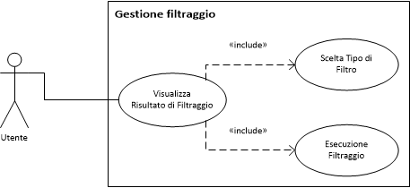

Descrizione dei casi d'uso
===

Titolo | Visualizzazione risultato filtraggio
--- | ---
**Descrizione** | Viene effettuata la ricerca di un determinato evento/gruppo di eventi
**Relazioni** | 
**Attori** | Utente
**Precondizioni** | <ul><li>Almeno un filtro è stato selezionato</li></ul>
**Postcondizioni** | Nessuna
**Scenario principale** | <ol><li></li> <li></li></ol>
**Scenari alternativi** | <ol start="1"><li><ol type="a"><li></li> <li>*Si ritorna al passo x* dello scenario principale</li></ol></li></ol>
**Requisiti non funzionali** | Nessuno
**Punti aperti** | Nessuno

